# 🎮 Classic Games Web Platform

> **Web-Based Development Project – LEI 2023/2024**

## 📋 Table of Contents
- Description
- How to Use
- Technologies Used

---

## 🤔 Description

This project was developed in a group setting as part of the **Web-Based Development (DBW)** course. It consists of a classic games platform called **Classic Games**, featuring three interactive games: Tic-Tac-Toe, Memory Game, and Hangman.

Beyond gameplay, the application includes authentication, user account customization, score tracking, and ranking systems. The architecture is modular and prepared for the future integration of additional games and features.

The team consisted of three members, whose names are available in the "About" section of the website. This project received a final grade of **20/20**.

---

## 🔗 Online Access

You can access the live version of the project here:  
👉 [Classic Games on Render](https://classic-games.onrender.com)

---

## 📝 How to Use

Upon opening the website, the user is greeted with the home page displaying the three game options centered on the screen. A navigation bar appears on all pages. On the left, it includes the site logo and links to: Instructions, About, News, and Home. On the right, there's a **Login** button that redirects to the registration page.

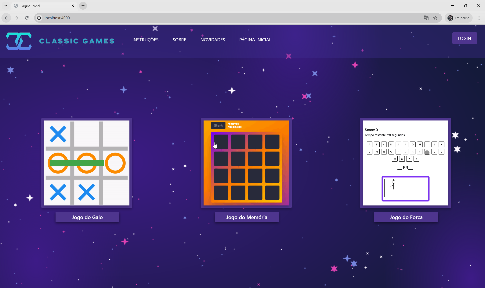

Each game on the home page is a button that leads to its game menu. If the user is not logged in, they will be redirected to the account creation page with a pop-up saying: _"You must register to access this content!"_ Pages like **About**, **News**, and **Home** are accessible without login.

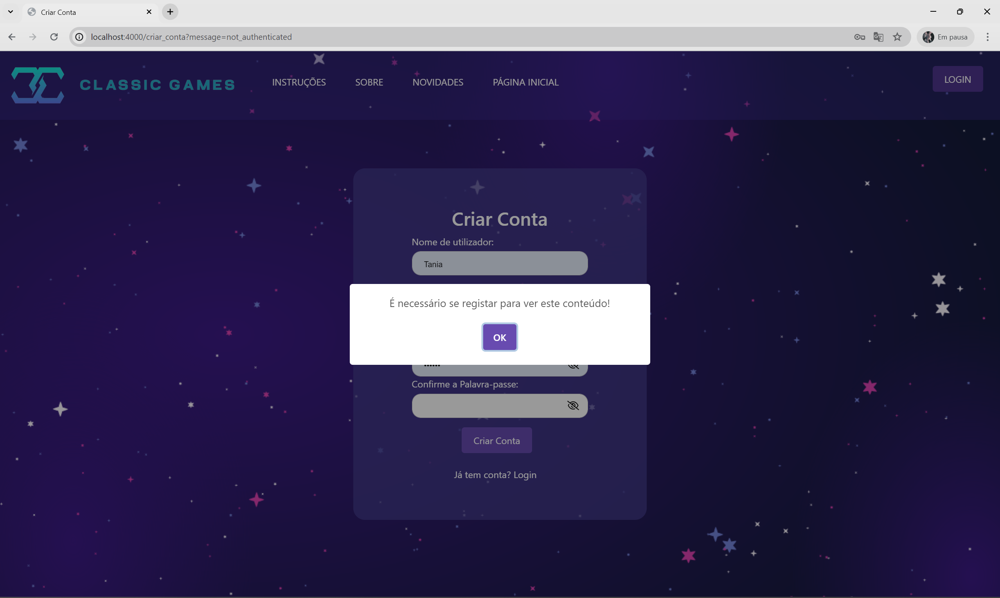

Clicking on **About** redirects to a page that briefly explains the site and lists its creators.

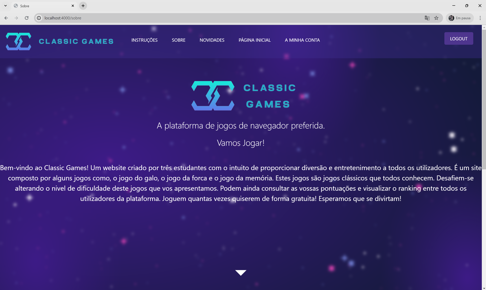

Clicking on **News** opens a page with upcoming game announcements. It’s publicly accessible to encourage users to register.

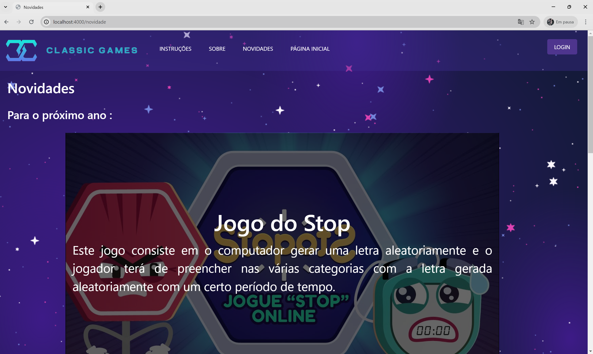

Clicking **Home** leads back to the home page (as described above). Clicking **Instructions** without being logged in shows the same registration-required pop-up and redirects to account creation.

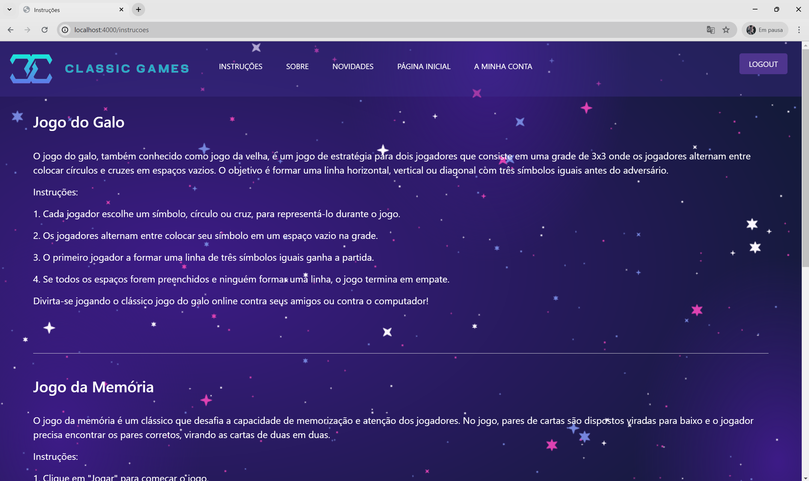

The **Create Account** page contains a form with: Username, Email, Password, and Confirm Password. A **Create Account** button submits the form. If the user already exists, an error popup appears. There's also a link below: _"Already have an account? Login"_, redirecting to the login page.

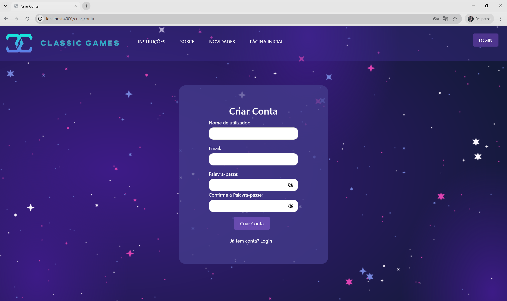

The **Login** page includes Username and Password fields. After logging in successfully, the user is redirected to the home page. Failed logins show a popup: _"User does not exist!"_. A link allows switching back to the registration form.

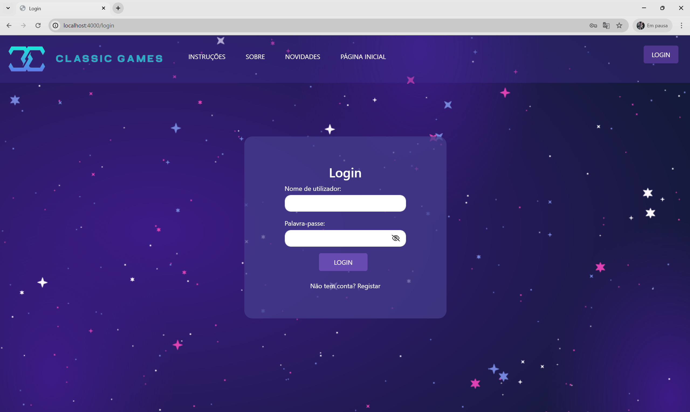

After logging in, the navigation bar updates: **Login** becomes **Logout**, and **My Account** is added. Users gain access to all features.

From the home page, clicking a game opens a game menu with three options: **Instructions**, **Difficulty**, and a play arrow. Instructions redirect to the game’s instruction section. If the user chooses difficulty, they are redirected to a page with 3 difficulty buttons. If they click play without selecting a difficulty, a pop-up appears.

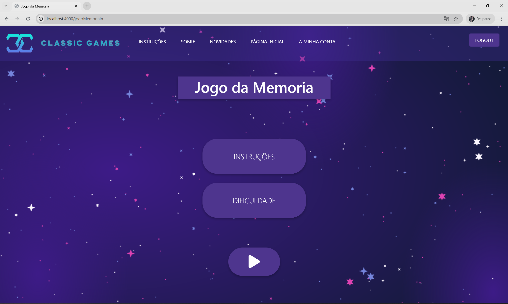

In the difficulty menu, the user selects between: Easy, Medium, or Hard. Clicking **Play** after choosing a difficulty redirects to the game.

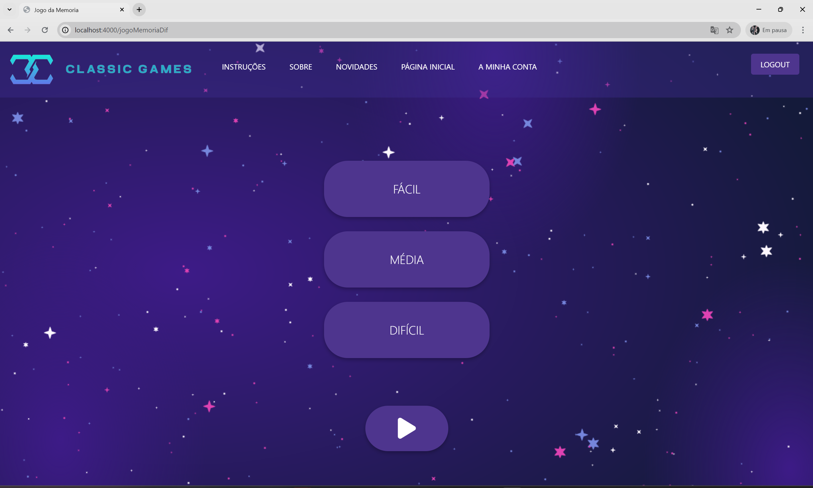

### Game Overviews:

- **Tic-Tac-Toe:** Immediate play; pop-ups show win messages and scores.
- **Memory Game:** Timer starts after first card. Matching pairs increase score. Completion shows a success popup.
- **Hangman:** Shows a loading screen, followed by category selection. The game displays a word (hidden) and letter buttons. Hints are available in Easy/Medium. Medium includes a timer. Hard removes hints.

### My Account Page:

Users can:
- Upload a profile image
- Edit username, email, password
- View individual scores
- View game leaderboards

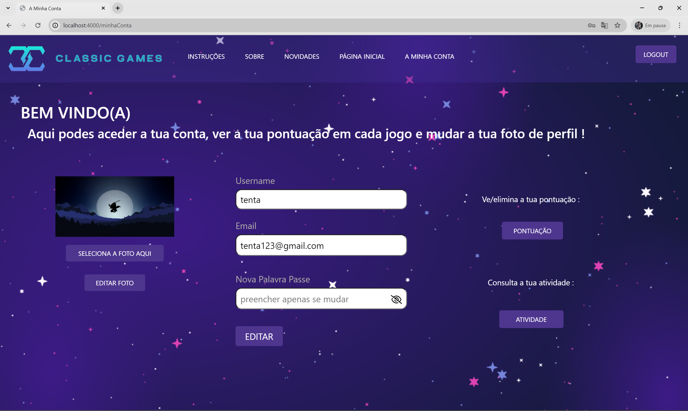

### Mobile Version:

The navigation bar turns into a hamburger menu on the left and a profile/login icon on the right. When logged in, the icon becomes a logout symbol.

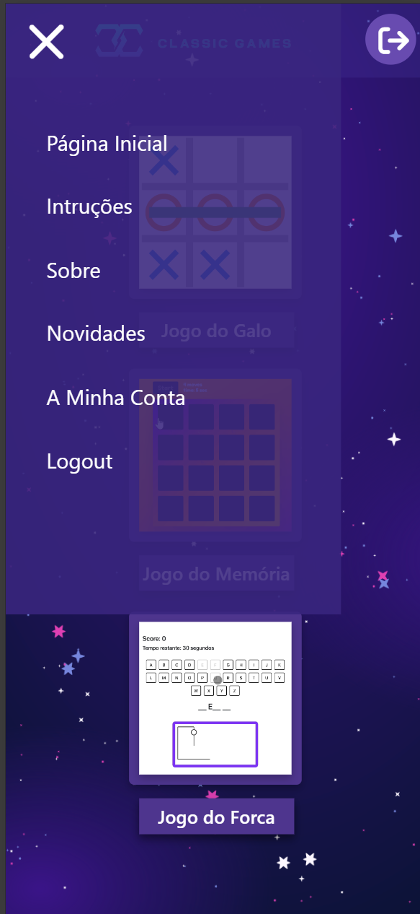
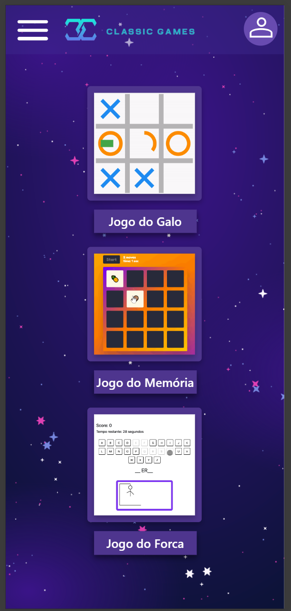


## 🧾 Installation

To run this project locally:

```bash
# Clone the repository
git git@github.com:mimicarreira13/classic-games-web.git

# Install dependencies
npm install

# Start the application
npm start


---

## ⚙️ Technologies Used

- EJS
- CSS
- MongoDB
- JavaScript
- Multer
- Nodemon
- Passport
- Font Awesome (Icons)
- Bootstrap
- SweetAlert (Popups)

---

